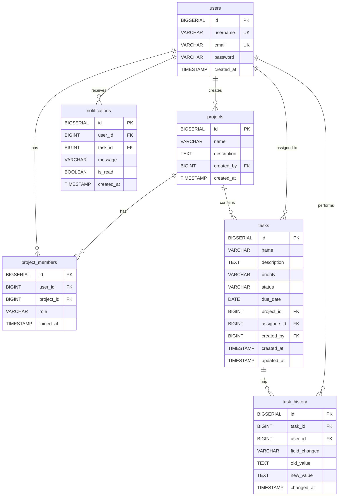

# Schéma de base de données — PMT

## Entités identifiées

| Entité | Description |
|--------|-------------|
| `users` | Comptes utilisateurs de la plateforme |
| `projects` | Projets créés par les utilisateurs |
| `project_members` | Association user ↔ project avec un rôle (table de liaison) |
| `tasks` | Tâches appartenant à un projet |
| `task_history` | Historique des modifications de chaque tâche |
| `notifications` | Notifications destinées à un utilisateur |

## Relations

- `users` **1,1 — 0,N** `projects` (un projet a un créateur)
- `users` **0,N — 0,N** `projects` via `project_members` (rôles : ADMIN, MEMBER, OBSERVER)
- `projects` **1,1 — 0,N** `tasks`
- `users` **1,1 — 0,N** `tasks` (assignation — optionnelle, donc 0,1)
- `tasks` **1,1 — 0,N** `task_history`
- `users` **1,1 — 0,N** `task_history` (qui a fait la modification)
- `users` **1,1 — 0,N** `notifications`

## Formes normales

- **1NF** : toutes les colonnes sont atomiques (pas de liste dans une cellule).
- **2NF** : toutes les tables ont une clé primaire simple (`id` BIGSERIAL) ; pas de dépendance partielle.
- **3NF** : aucune dépendance transitive. L'information dérivée (ex. nombre de membres d'un projet) n'est pas stockée.

## Diagramme Mermaid

## Énumérations

- **role** : `ADMIN`, `MEMBER`, `OBSERVER`
- **priority** : `LOW`, `MEDIUM`, `HIGH`
- **status** : `TODO`, `IN_PROGRESS`, `DONE`
